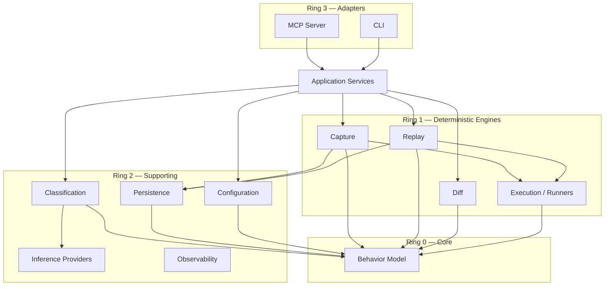

# KEEL — Domain Analysis

> Document 01 · Status: FROZEN — Architecture v1.0 (2026-07-12)

This document identifies the bounded contexts of KEEL, their responsibilities, their dependencies, and the boundaries between them. Terminology here is normative for the whole project — code, docs, and MCP tool names must use these words with these meanings (DDD ubiquitous language).

---

## 1. Ubiquitous Language

| Term | Meaning |
|------|---------|
| **Probe** | A named, replayable invocation of the code under observation (command, args, stdin, env, cwd, capture mode). The unit of behavioral observation. |
| **Execution** | One concrete run of a probe by a runner, producing raw observations. |
| **Observation** | A single recorded fact from an execution (exit code, an stdout stream, a fs effect, a captured network call, a function I/O pair in deep mode). |
| **Snapshot** | The *normalized, canonical* set of observations for one execution. Snapshots are the comparable unit. |
| **Baseline** | An immutable, named set of snapshots (one per probe) bound to provenance (git commit, config hash, environment fingerprint). "The behavior the developer blessed." |
| **Replay** | Re-executing a baseline's probes under equivalent controlled conditions after an edit. |
| **Divergence** | One typed, structural difference between a baseline snapshot and a replay snapshot. A deterministic fact. |
| **Classification** | An advisory label on a divergence: `intended` / `collateral` / `uncertain`, with confidence and rationale. |
| **Verdict** | The overall machine-readable result of a check: divergence set + classifications + summary status (`clean` / `diverged` / `error`). |
| **Runner** | The component that executes a probe in a controlled environment for a given language/runtime. |
| **Interceptor** | A runner-owned mechanism that tames a source of nondeterminism (clock, RNG, network, env) during execution. |

---

## 2. Domain Map

Eleven domains, in four rings. Inner rings must not depend on outer rings (dependency rule of Clean Architecture).

```
Ring 0 (pure domain):      Behavior Model (entities, canonical forms, hashing)
Ring 1 (deterministic
        engines):          Capture · Replay · Diff · Execution(Runner)
Ring 2 (supporting):       Persistence · Configuration · Classification(AI) · Observability
Ring 3 (adapters/edges):   MCP · CLI · Developer Experience
```

### 2.1 Behavior Model (core domain, Ring 0)

- **Responsibility:** Defines Probe, Snapshot, Baseline, Divergence, Verdict as pure data with invariants; defines canonical serialization and content hashing.
- **Depends on:** Nothing but the standard library. Zero I/O, zero side effects.
- **Boundary:** This is the *only* vocabulary shared across all other domains. If two domains need to talk, they exchange Behavior Model types — never each other's internals.
- **Why it's the core domain:** Everything else is mechanism. The competitive substance of KEEL is "what is a comparable unit of behavior and when are two of them equal?" — that lives here.

### 2.2 Capture (Ring 1)

- **Responsibility:** Orchestrates baseline creation: resolve probes from config → dispatch to Execution → normalize raw observations into Snapshots → assemble a Baseline with provenance → hand to Persistence.
- **Depends on:** Behavior Model, Execution (port), Persistence (port), Configuration.
- **Boundary:** Owns *normalization policy* (what is volatile, what is canonical order). Does not know how execution happens or where bytes are stored.

### 2.3 Replay (Ring 1)

- **Responsibility:** Re-creates the conditions of a baseline's executions: same probes, same interception settings, same input material (including replaying recorded network responses in stub mode). Produces fresh Snapshots comparable to the baseline's.
- **Depends on:** Behavior Model, Execution (port), Persistence (port).
- **Boundary:** Replay must never consult the baseline's *outputs* while producing new snapshots (no peeking — prevents accidental self-fulfilling comparisons). It consumes only the baseline's *inputs and conditions*.

### 2.4 Execution / Runner (Ring 1)

- **Responsibility:** Runs one probe in a controlled subprocess: sandboxing, environment control, interceptors, timeout, cancellation, output streaming, resource caps. Emits raw Observations.
- **Depends on:** Behavior Model. Nothing else in KEEL.
- **Boundary:** The *only* domain allowed to spawn processes. Language-specific knowledge (how to preload a Node clock shim, how to seed Python's RNG) lives in runner plugins behind one `Runner` port.

### 2.5 Diff (Ring 1)

- **Responsibility:** Given two Snapshots, produce a deterministic, ordered set of typed Divergences, honoring ignore rules. Pure function of its inputs.
- **Depends on:** Behavior Model only.
- **Boundary:** No I/O. No configuration loading (rules are passed in, already validated). This purity is what makes L4 (determinism) testable by property tests.

### 2.6 Classification (Ring 2 — deliberately not Ring 1)

- **Responsibility:** Annotate Divergences with intent labels. Two tiers: deterministic heuristics, then local LLM via an Inference port.
- **Depends on:** Behavior Model, Inference provider port, Configuration.
- **Boundary:** Output is *additive metadata* on a Verdict. The Verdict is complete and valid before Classification runs. Classification failures degrade the verdict's annotations, never its facts. This structural placement is how L1/L2 are enforced by architecture instead of discipline.

### 2.7 Inference (Ring 2)

- **Responsibility:** Abstract "local text model in, structured judgment out." Providers: Ollama first; llama.cpp-server and LM Studio later (all speak local HTTP on loopback).
- **Depends on:** Nothing in KEEL except shared error/logging types.
- **Boundary:** Knows nothing about divergences or code. Classification composes prompts; Inference moves tokens. This split lets us swap providers without touching prompt logic and vice versa.

### 2.8 Persistence (Ring 2)

> Naming note (frozen): **Persistence** is the domain name; its implementing module is **`storage/`** (Doc 03). These are the only two names for this concept — "database layer," "repo layer," etc. are forbidden vocabulary.

- **Responsibility:** Durable storage of baselines, snapshots, verdicts, and blobs. SQLite metadata index + content-addressed object store. Migrations, integrity checking, garbage collection.
- **Depends on:** Behavior Model.
- **Boundary:** Repository interfaces defined by the domains that need them (dependency inversion): `BaselineRepository`, `VerdictRepository`, `ObjectStore`. SQLite is an implementation detail invisible above this boundary.

### 2.9 Configuration (Ring 2)

- **Responsibility:** Load, merge, validate, and freeze configuration (file → env → CLI/MCP overrides). Produce an immutable, versioned `ConfigSnapshot` whose hash participates in baseline provenance.
- **Depends on:** Behavior Model (for the hash), schema validation.
- **Boundary:** Everything downstream receives a validated snapshot; nothing downstream reads env vars or files directly.

### 2.10 Observability (Ring 2)

- **Responsibility:** Structured logging, correlation IDs, timing spans, diagnostics bundle (`keel doctor`). **No telemetry exists.** There is no telemetry domain; L3 forbids it. Observability is strictly local: logs on disk, metrics in the verdict.
- **Depends on:** Nothing in KEEL.
- **Boundary:** Injected as a capability; no module imports a global logger (testability, and keeps Ring 0/1 pure).

### 2.11 MCP, CLI, Developer Experience (Ring 3)

- **Responsibility:** MCP server and CLI are thin adapters over one shared application service layer (`CheckService`, `CaptureService`, `ReportService`). DX covers `keel init` scaffolding, error message quality, docs, examples.
- **Depends on:** Application services only.
- **Boundary:** Adapters contain zero business logic. The acid test: any behavior expressible via MCP must be expressible via CLI with identical results, because both call the same service. If an adapter needs an `if`, the logic probably belongs below.

---

## 3. Domain Dependency Graph



**Forbidden edges (enforced by dependency-cruiser in CI):**

- Ring 0 → anything.
- Diff → Persistence, Diff → Configuration, Diff → any I/O (Diff is pure).
- Anything → Inference except Classification.
- Ring 1 → Classification or Inference (the deterministic core cannot even *see* AI).
- Adapters → Engines directly (must pass through Application Services).
- Anything → MCP/CLI.

---

## 4. Principle Mapping

| Principle | Where applied |
|-----------|---------------|
| **SRP** | Each Ring 1 engine answers one question (run / normalize / compare). Inference vs. Classification split (transport vs. judgment). |
| **OCP** | Runner plugins, Inference providers, Divergence classifiers, ignore-rule matchers are all extension points behind stable ports. |
| **LSP** | Every `Runner` must satisfy the runner contract test suite (Doc 13) — substitutability is *tested*, not assumed. |
| **ISP** | Repositories are per-consumer (`BaselineRepository` ≠ `VerdictRepository` ≠ `ObjectStore`), not one god `Storage` interface. |
| **DIP** | Domains define the ports they consume; infrastructure implements them. SQLite, Ollama, child_process are all leaf details. |
| **DRY** | One Behavior Model vocabulary; one canonical serializer; one service layer under both adapters. |
| **KISS/YAGNI** | No plugin marketplace, no event bus, no DI framework (manual constructor wiring), no monorepo package explosion — see Doc 03. |
| **Composition over inheritance** | Runners compose interceptors; classifiers compose tiers. No abstract base classes with template methods. |
| **Deterministic core / AI at the edge** | Rings 0–1 cannot import Classification or Inference (CI-enforced). |
