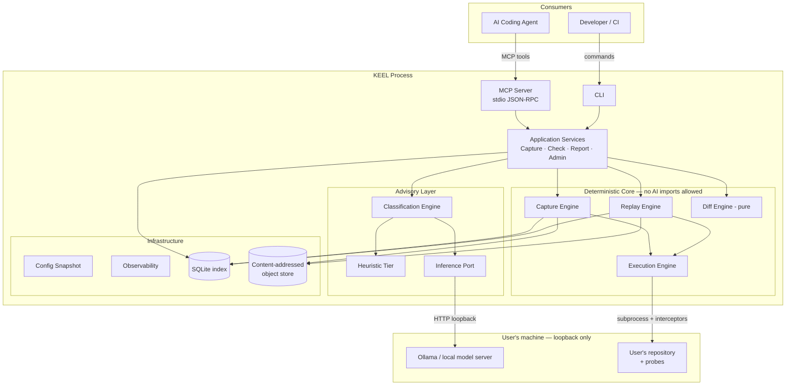
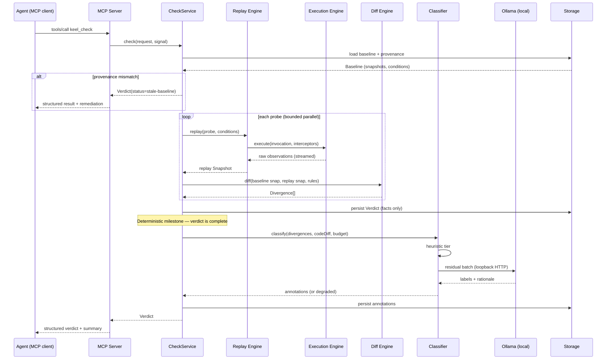
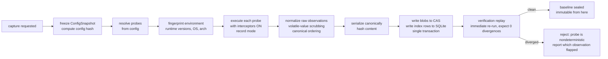
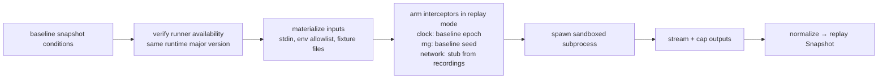
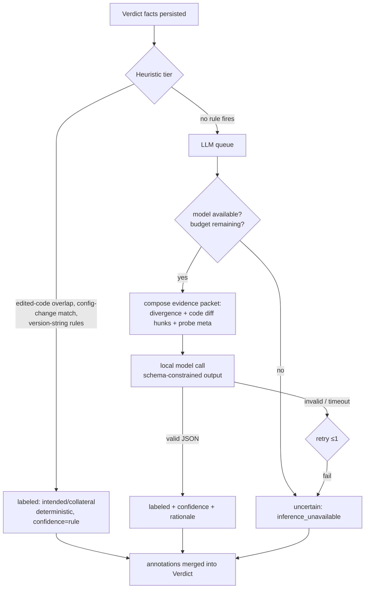
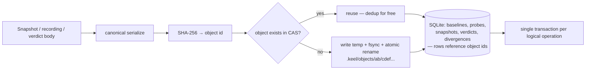

# KEEL — High-Level Design & System Diagrams

> Document 02 · Status: FROZEN — Architecture v1.0 (2026-07-12)

---

## 1. Major Components

| Component | Responsibility | Ring |
|-----------|----------------|------|
| **keel-core (Behavior Model)** | Entities, invariants, canonical JSON serialization, content hashing | 0 |
| **Capture Engine** | Baseline creation pipeline (resolve → execute → normalize → persist) | 1 |
| **Replay Engine** | Condition reconstruction and re-execution | 1 |
| **Diff Engine** | Pure structural comparison → typed divergences | 1 |
| **Execution Engine** | Runner registry, subprocess sandbox, interceptors, streaming | 1 |
| **Classification Engine** | Heuristic tier + LLM tier intent labeling | 2 |
| **Inference Layer** | Provider abstraction over local model servers (Ollama first) | 2 |
| **Storage Layer** | SQLite index + content-addressed object store, migrations, GC | 2 |
| **Config System** | Layered load, validation, immutable snapshot, config hash | 2 |
| **Observability** | Structured local logging, spans, correlation IDs, doctor | 2 |
| **Application Services** | `CaptureService`, `CheckService`, `ReportService`, `BaselineAdminService` — use-case orchestration | 2/3 seam |
| **MCP Server** | stdio JSON-RPC adapter exposing tools to agents | 3 |
| **CLI** | Human/CI adapter over the same services | 3 |

The **Application Services** layer is the deliberate seam between "engines" and "the outside world." It owns transactions ("capture is atomic"), workflow ordering, and cancellation propagation. Engines stay ignorant of use cases; adapters stay ignorant of engines.

---

## 2. Overall Architecture Diagram

---

## 3. Request Lifecycle: `keel check` (the flagship flow)

1. **Ingress** (MCP tool call `keel_check` or CLI `keel check`). Adapter validates transport-level input, mints a correlation ID, calls `CheckService.check(request, signal)`.
2. **Config resolution.** Service obtains the frozen `ConfigSnapshot` (already loaded at process start; re-validated on file change in watch mode).
3. **Baseline selection.** `BaselineRepository` resolves the target baseline (explicit ID, or "latest for this branch"). Provenance is validated: if the baseline's config hash or environment fingerprint mismatches current, the verdict is `stale-baseline` — *not* a diff against garbage. This guardrail is a first-class outcome, not an error.
4. **Replay.** Replay Engine reconstructs each probe's conditions and dispatches to the Execution Engine (bounded parallelism). Raw observations → normalization → fresh Snapshots. Progress streams to the adapter (MCP progress notifications / CLI spinner).
5. **Diff.** For each probe: baseline snapshot vs. replay snapshot → ordered divergence list. Hash short-circuit: identical snapshot hashes skip structural descent entirely.
6. **Verdict assembly (deterministic milestone).** A complete, valid Verdict now exists: `clean` or `diverged` with N divergences. **It is persisted at this point**, before any AI runs. A crash after this point loses annotations, never facts.
7. **Classification (advisory, budgeted).** Heuristic tier labels what it can. Remaining divergences batch to the LLM tier with a wall-clock budget and cancellation. Results merge into the verdict as annotations; failures mark divergences `uncertain(reason=inference_unavailable)`.
8. **Egress.** Adapter projects the Verdict: MCP returns the structured document; CLI renders human output from the same document. Exit code / tool result follows the five-code contract (Doc 10 §C2): `0` clean · `1` diverged · `2` user-actionable (incl. `stale-baseline`) · `3` environment · `4` internal.

**Response lifecycle invariant:** every response is a projection of a persisted Verdict. There is no path where an adapter fabricates response content — replaying `keel report <verdict-id>` must reproduce exactly what the caller saw.

---

## 4. Sequence Diagram — Regression Check

---

## 5. Baseline Capture Workflow

Step **I** is a deviation worth defending: a baseline is only sealed after an immediate self-replay proves the probe is deterministic under our interception. This converts "flaky probe" from a runtime false-positive (destroys trust) into a capture-time error with a pinpointed cause (builds trust). It doubles capture cost; capture is rare and trust is everything, so the trade is correct.

## 6. Replay Workflow

## 7. Classification Workflow

## 8. Persistence Workflow

---

## 9. Component Interaction Rules (summary)

1. Adapters call Services. Services orchestrate Engines. Engines exchange Behavior Model types.
2. Only the Execution Engine spawns processes. Only Storage touches SQLite/CAS. Only Inference opens sockets (loopback only). Only Config reads env.
3. Cancellation is an `AbortSignal` threaded from adapter to subprocess kill — every long operation accepts one (single mechanism, no bespoke cancellation flags).
4. All cross-component data is immutable after construction. Engines never mutate a Snapshot or Verdict in place; annotation is a persisted, append-only operation.
