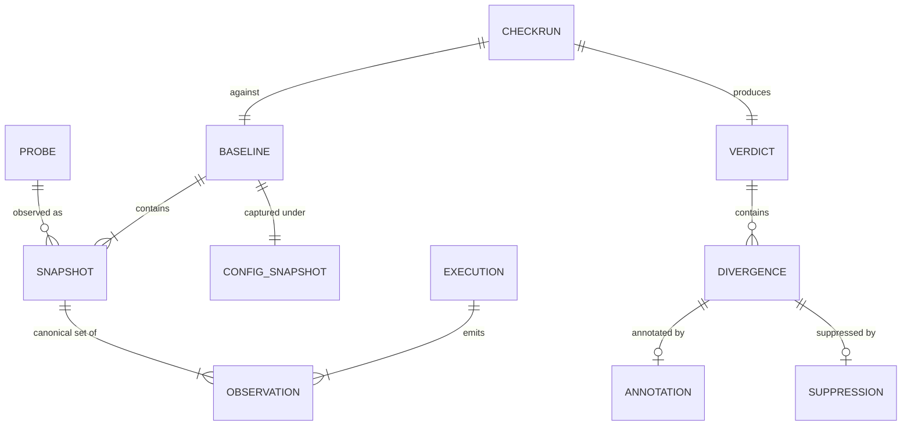

# KEEL — Data Model

> Document 04 · Status: FROZEN — Architecture v1.0 (2026-07-12)

All persisted entities are immutable documents identified by ULID (creation-ordered) and stamped with a `schemaVersion`. Content-bearing payloads are additionally content-hashed (SHA-256) for the object store. "Owner" below means the module allowed to construct the entity.

---

## 1. Entity Catalog

### Probe (owner: config)
The unit of behavioral observation. Declared by the developer in `keel.config`.

| Field | Notes |
|-------|-------|
| `name` | unique within config; stable identity across baselines |
| `runner` | `command` \| `node` \| plugin id |
| `invocation` | command, args, cwd (repo-relative), stdin source, env allowlist |
| `captureMode` | `process` (exit/stdout/stderr/fs) — deep modes later |
| `interception` | clock policy, rng policy, network policy (`record` / `stub` / `passthrough-forbidden`) |
| `limits` | timeout, max output bytes, max fs effect bytes |
| `ignoreRules` | probe-scoped normalization/ignore matchers |
| `hooks` | optional `setup` / `teardown` commands (fixture lifecycle, e.g. seed a local DB). Hook scripts are content-hashed; the hashes participate in `probeSpecHash`, so a changed fixture honestly invalidates the baseline. (Freeze amendment — added now because retrofitting probe schema is expensive.) |

*Lifecycle:* exists only as config; a `ProbeSpecSnapshot` (frozen copy + hash) is embedded in every Baseline so baselines survive config edits.

### Execution (owner: execution engine)
One concrete run. Ephemeral by default; persisted only inside capture (as provenance) or on failure (for diagnosis).

Fields: `probeName`, `runnerDescriptor` (runner id + runtime version + platform), `startedAt` (wall time — recorded but **excluded from canonical content**), `duration`, `exitStatus` (code / signal / timeout / cancelled), `rawObservationRefs`, `interceptorReport` (what was tamed, seeds used, recorded-call count).

### Observation (owner: execution engine)
Tagged union; each variant has its own canonical form:

- `exit` — code or signal.
- `stream` — stdout/stderr as bytes; canonical form is post-normalization text with encoding metadata.
- `fsEffect` — path (repo-relative), kind (created/modified/deleted), content hash, mode. Collected via before/after manifest of declared watch paths (not inotify — portability, determinism of collection order).
- `netCall` — request shape + response (record mode); ordered by request sequence.
- `funcIO` — reserved for deep mode (v2+): callsite id, args hash, return hash.

### Snapshot (owner: capture/replay)
The comparable unit: normalized observations for one execution of one probe.

Fields: `probeName`, `probeSpecHash`, `observations[]` (canonical order: exit, streams, fsEffects sorted by path, netCalls by sequence), `normalizationRulesetVersion`, `contentHash` (Merkle root: hash of observation hashes — enables O(1) equality and subtree short-circuit in diff), `objectRef`.

### Baseline (owner: capture)
| Field | Notes |
|-------|-------|
| `id`, `label` | label e.g. branch name or user-supplied |
| `snapshots` | map probeName → snapshot ref |
| `provenance` | git commit + dirty flag, config hash, environment fingerprint (OS, arch, runtime versions), keel version, ruleset version |
| `sealedAt` | set only after verification replay passes |
| `status` | `capturing` → `sealed` \| `rejected(nondeterministic)` |

*Immutability:* a sealed baseline never changes. Re-capture creates a new Baseline; old ones are GC candidates by retention policy.

### CheckRun / Verdict (owner: services)
`CheckRun` records the act; `Verdict` is its result document.

Verdict fields: `id`, `baselineId`, `replaySnapshotRefs`, `status` (`clean` / `diverged` / `stale-baseline` / `error(partial|total)`), `divergences[]`, `annotations[]` (appended after classification), `codeDiffRef` (the git diff evaluated, for provenance and classification evidence), `timing` (per-phase durations — local performance observability).

### Divergence (owner: diff)
Deterministic fact. Fields: `probeName`, `path` (structured pointer into the snapshot: observation kind + locator, e.g. `stream:stdout/json:$.items[3].price`), `kind` (taxonomy in Doc 06), `baselineValueRef`, `candidateValueRef` (refs, not inline — values may be large), `stableId` (hash of probe+path+kind — lets annotations and suppressions survive re-runs).

### Classification / Annotation (owner: classify)
Append-only. Fields: `divergenceStableId`, `label` (`intended` / `collateral` / `uncertain`), `confidence` (0–1), `tier` (`heuristic:<ruleId>` / `llm:<model>`), `rationale` (text, advisory), `evidencePacketHash` (reproducibility of what the model saw).

### ConfigSnapshot (owner: config)
Validated, frozen, hashed configuration. Embedded by hash in Baseline provenance and Verdict.

### Suppression (owner: services, user-initiated)
"This divergence is accepted." Fields: `divergenceStableId` or rule pattern, `reason`, `createdBy` (`cli` / `mcp`), `expiry` (optional), `status` (`active` / `absorbed` / `expired`). Suppressions are the mechanism for "accept this change without re-capturing everything" — they filter verdict *presentation*, never the underlying facts.

*Lifecycle across re-capture (ADR-014):* when a new baseline seals, each active suppression is evaluated — if its divergence no longer occurs (the accepted change is now the baseline), it transitions to `absorbed`: inactive, retained for audit, reported in `keel status`. Suppressions are never silently deleted, and an absorbed suppression never masks a *future* divergence at the same path.

---

## 2. Relationships

---

## 3. Lifecycle & Ownership Rules

1. **Facts before annotations:** a Verdict row is committed with divergences before any Annotation exists; annotations append later. Readers must treat un-annotated divergences as `uncertain`.
2. **Nothing edits, everything appends:** the only UPDATEs in the system are status transitions (`capturing→sealed`) and GC deletes. This makes the store trivially auditable and crash-safe.
3. **Stable IDs bridge runs:** `Divergence.stableId` is deliberately content-derived (not ULID) so that suppressions and prior classifications can be joined across check runs — this powers "you already accepted this exact change."
4. **GC ownership:** storage owns retention (default: keep last N baselines per label + anything referenced by a suppression); services own the user-facing `keel baseline rm` path. CAS objects are deleted only when unreferenced (refcount by scan, git-gc style, run explicitly — never in the background during checks).
