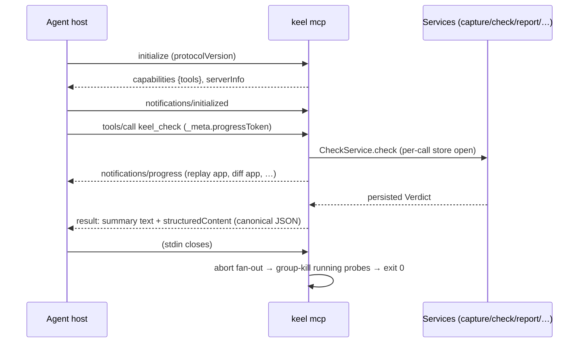

# KEEL over MCP — Protocol Guide

KEEL's primary interface (ADR-002): AI coding agents consult the oracle mid-edit-loop. The MCP layer is a pure adapter (Doc 20 §12) — identical semantics to the CLI by construction, because both project the same Application Services.

## Connecting

The host spawns `keel mcp` in the workspace (stdio transport, newline-delimited JSON-RPC 2.0; supported protocol revisions are pinned in [mcp-tools.lock.json](../reference/mcp-tools.lock.json)). Typical host config:

```json
{ "mcpServers": { "keel": { "command": "keel", "args": ["mcp"] } } }
```

## Lifecycle



## The result contract (Doc 09 §4)

Every tool result carries a one-line summary (for transcripts) **and** `structuredContent` (schema-versioned JSON, also serialized canonically as a text block for older hosts). **Domain outcomes are successful results**, never protocol errors: `not-initialized`, `busy` (with the blocking operation named), `stale-baseline` verdicts, and service errors all arrive as `{status, …, remediation}` documents an agent can branch on. JSON-RPC errors occur only for malformed requests, unknown tools, or schema-invalid arguments (path-precise, e.g. `arguments.label: expected string`).

Concurrency: one operation per workspace at a time — a second `tools/call` returns `{status:'busy', blocking:{tool, opId}}` immediately (Doc 09 §2). Cancellation: `notifications/cancelled {requestId}` aborts the in-flight call; probe subprocesses die with it (process-group kill).

## Tool reference

The authoritative, CI-locked schemas live in [docs/reference/mcp-tools.lock.json](../reference/mcp-tools.lock.json). Summary: `keel_status` (cheap pre-flight) · `keel_capture {label, probes?}` (seal a baseline; rejection names the flapping path) · `keel_check {label?|baselineId?, all?, probes?, classify?, budgetMs?}` (the oracle; diff-scoped by default — v1 soundly over-approximates to all probes until the Phase 12 dependency map; `classify` is inert until Phase 9 and says so) · `keel_explain {stableId, verdictId?}` (deep divergence detail) · `keel_suppress {stableId|pattern, reason, expiresInDays?}` (accept a change; ADR-014 lifecycle). Verdict/report document shape: [verdict-format.md](verdict-format.md).

A complete scripted session lives in [examples/agent-loop](../../examples/agent-loop/).
