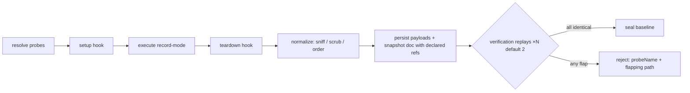

# `capture/` — Capture Engine (Ring 1)

Contract: [Doc 20 §3](../../../../docs/architecture/20-module-contracts.md) · Design: [Doc 06 Part A](../../../../docs/architecture/06-baseline-and-diff.md) · Playbook: [Doc 24 P4](../../../../docs/architecture/24-implementation-playbooks.md)

**Who may import this module:** services. **What this module imports:** model, execution, observability, shared — **not storage and not config** (Doc 21). Storage arrives through capture's consumer-owned ports (`ObjectSinkPort`, `DocumentSinkPort`, `BaselineSinkPort` — C22; `KeelStore`'s pieces satisfy them structurally at the services seam), and configuration arrives as capture's own input types, mapped by `CaptureService`.

## Pipeline (Doc 06 A1)

Hooks wrap **every** run including verification replays (a stateful fixture must be re-prepared each time or verification honestly rejects it). Verification comparison is capture-internal equality plus first-difference naming (`stream:stdout/json:$.rand`) — deliberately *not* the Phase 5 Diff Engine: no typed divergences, no ignore rules.

## Normalization ruleset (`rules/1`)

Conservative by principle: a false positive silently erases behavior; a false negative only causes an actionable capture-time rejection. Volatiles: ISO timestamps, UUIDs, hex addresses, temp paths (covers engine workspaces). Secrets (scrub **and** flag; the value never reaches store, logs, or findings): AWS access keys, GitHub tokens, bearer tokens, private-key blocks. Streams: UTF-8 decode (binary passthrough) → JSON sniff (canonical re-serialization) → scrub → CRLF-normalized text. Replacement tokens use guillemets so no rule can re-match its output — idempotence is property-tested. Users add rules in `keel.config.jsonc → normalization.rules`; the ruleset version participates in provenance, so rule changes honestly invalidate baselines.

## Interception mapping (honesty rules)

`clock: 'virtual'`, `rng: 'seeded'`, `network: 'record'|'stub'` hard-require the corresponding runner capability — negotiation fails loudly on runners without them. `network: 'forbidden'` is **declarative on interceptor-less runners** (the command runner cannot observe network traffic — Doc 05 §1); it becomes enforced on interceptor-bearing runners (Phase 7).

## Failure vocabulary

`UserError`: `KEEL_E_CAPTURE_NO_PROBES`, `_UNKNOWN_PROBE`, `_PROBE_FAILED` (timeout/output-limit, stderr attached), `_HOOK_FAILED`, `_CANCELLED`, `_INVALID_LABEL`. Nondeterminism is **not an error**: it returns `{status:'rejected'}` with the rejected baseline persisted for diagnostics.
