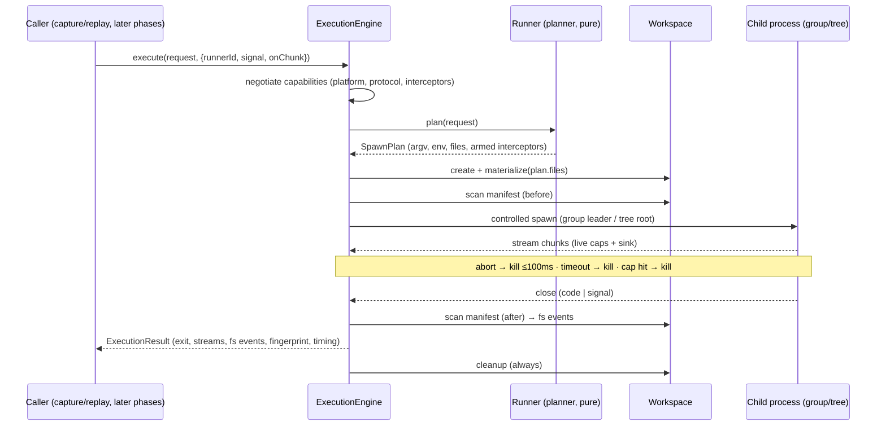
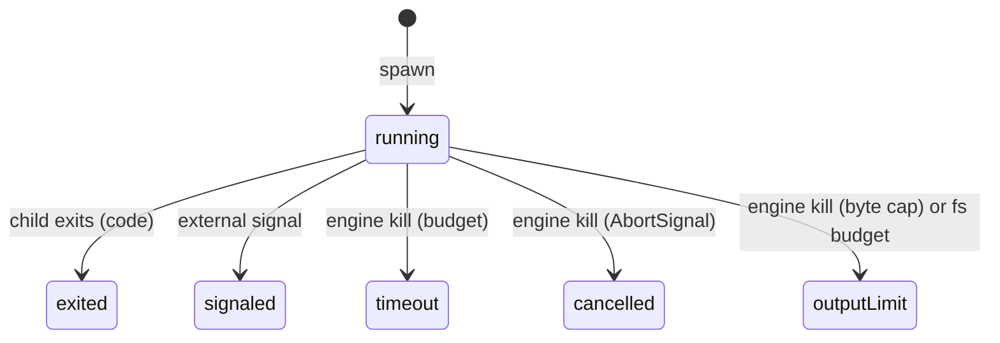

# `execution/` — Execution Engine (Ring 1)

Contract: [Doc 20 §2](../../../../docs/architecture/20-module-contracts.md) · Design: [Doc 05](../../../../docs/architecture/05-execution-engine.md) · Kill mechanism: [ADR-017](../../../../docs/adr/0017-windows-tree-kill.md)

**Who may import this module:** capture, replay (via ports), composition roots. **What this module imports:** model, shared, observability, `@keel/runner-sdk` — nothing else (CI rule `execution-is-isolated`). **This is the only module in KEEL that spawns processes (C23)** — runner plugins *plan*, the engine spawns, so every plugin inherits correct kill/cap/timeout behavior.

## Execution lifecycle

## Exit status model (C42: user-code failure is data)

The engine **throws** only for its own faults: `ExecutionFault` (spawn failure), `EnvironmentError` (runner missing `KEEL_E_EXEC_RUNNER_MISSING`, negotiation failure `KEEL_E_EXEC_NEGOTIATION_FAILED`, plan rejection), `UserError` (unsupported platform, workspace escape, malformed allowlist). Timeout, cancellation, and caps are `ExitStatus` variants, never errors.

## Kill semantics (ADR-017)

POSIX: children are process-group leaders; SIGTERM to `-pid`, grace window (`limits.graceMs`), SIGKILL to the group. Abort initiates the kill synchronously (≤100ms budget, C44). Windows: `taskkill /T /F` tree termination — immediate and forced (no graceful tree signal exists); zero-orphans is asserted by the e2e suite on all platforms.

## Determinism

`ExecutionResult.fingerprint` hashes only conditions (platform, runner identity, armed interceptor versions) — never wall-clock, PIDs, or paths (C7). `startedAtEpochMs`/`durationMs` are alongside, explicitly outside the fingerprint. Manifest paths are workspace-relative POSIX, so fs events compare across platforms.

## Extension

New runners implement the `Runner` port from `@keel/runner-sdk` and must pass `runnerContractChecks` — see the [runner author guide](../../../runner-sdk/README.md). Register at a composition root via `RunnerRegistry`; the engine discovers nothing implicitly.
