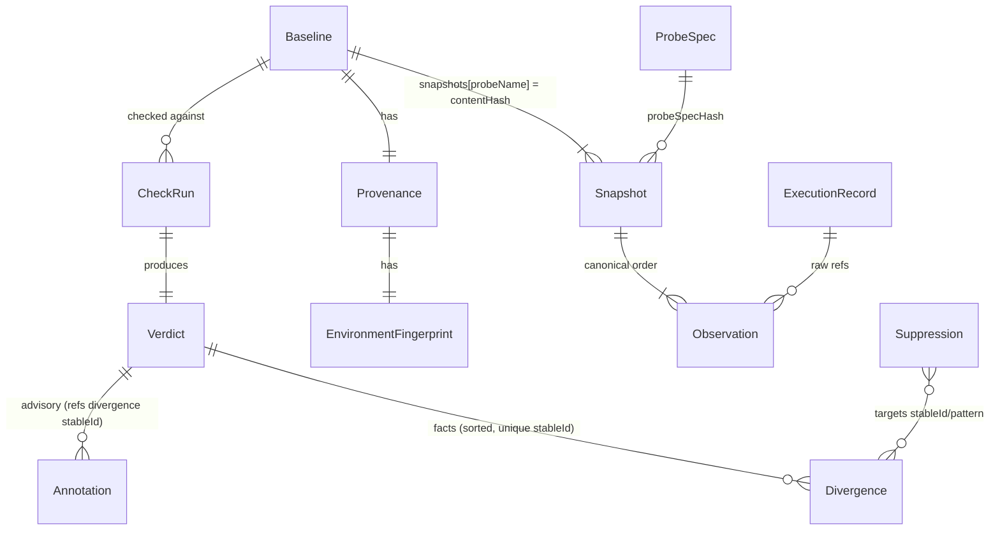
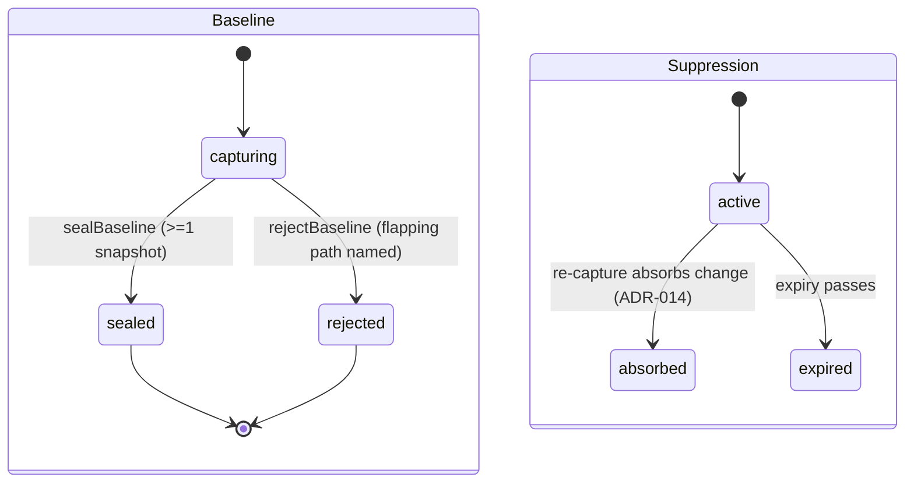

# `model/` — Behavior Model (Ring 0)

Contract: [Doc 20 §1](../../../../docs/architecture/20-module-contracts.md) · Data model: [Doc 04](../../../../docs/architecture/04-data-model.md) · Canonical rules: [Doc 06 A3](../../../../docs/architecture/06-baseline-and-diff.md)

**Who may import this module:** everyone. **What this module imports:** nothing from KEEL and nothing from npm (CI-enforced: `model-imports-nothing`, `model-no-npm`). The single platform import is `node:crypto` for synchronous SHA-256 — inside the frozen "stdlib only" budget (Doc 01 §2.1); WebCrypto was rejected because async digests would poison pure construction paths.

**Error note:** Doc 20 §1 names `InternalError` as the failure boundary; since C21 forbids importing `shared/`, model throws its own `ModelError` family (`CanonicalizationError`, `HashMismatchError`, `ValidationError`) with the same bug-class semantics. Services translate at the boundary (C58).

## Entities and ownership

## Lifecycles

Verdicts have a two-step construction, not a state machine: `createVerdict` (facts, zero annotations — C11) then one-shot `withAnnotations` (validated references — never mutates facts).

## Canonical serialization (CANONICAL_FORM_VERSION 1)

Authoritative spec lives as the header comment in [canonical.ts](canonical.ts); summary: UTF-8 JSON text · NFC-normalized strings and keys · keys sorted by UTF-16 code unit after NFC (collisions rejected) · `undefined` object entries omitted, `undefined` array elements rejected · finite numbers only, `-0 → 0`, ECMA-262 shortest-round-trip formatting · plain objects/arrays only, cycles rejected. Every rule is host-independent; golden fixtures in [__tests__/golden/](__tests__/golden/) freeze the bytes — changing them requires a version bump and an ADR.

## Content addressing (HASH_VERSION sha-256/1)

`contentHashOf(value)` = SHA-256 over canonical bytes, lowercase hex. Snapshot `contentHash` is a domain-separated Merkle root over per-observation hashes (O(1) equality; subtree short-circuit in diff). Divergence `stableId` = hash of `(probeName, path, kind)` — bridges check runs for suppressions and prior classifications. `ExecutionRecord` hashing excludes wall-clock fields (C7).

## Extension points

New `Observation` variants: add a tagged variant + comparator arm + validation + schema-version bump (Doc 20 §1). `DIVERGENCE_KINDS` is a closed taxonomy — additions are minor-version events (Doc 06 B3). `funcIO` observations are reserved for v2 and deliberately not constructible.
