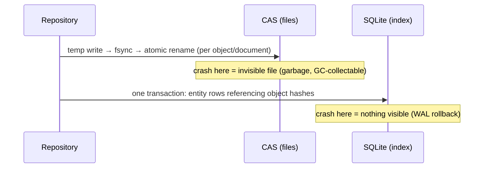

# `storage/` — Persistence (Ring 2)

Contract: [Doc 20 §8](../../../../docs/architecture/20-module-contracts.md) · Design: [Doc 08](../../../../docs/architecture/08-storage.md) · ADRs: [003](../../../../docs/adr/0003-sqlite-index-plus-cas.md) (hybrid), [012](../../../../docs/adr/0012-baseline-branch-worktree-semantics.md) (resolution), [014](../../../../docs/adr/0014-suppression-lifecycle.md), [018](../../../../docs/adr/0018-cas-gzip-compression.md) (gzip)

**Who may import this module:** services and (via their ports) capture/replay; composition roots. **What this module imports:** model, shared, observability. **SQLite never leaves this module** — C36 is machine-enforced by the `sqlite-only-in-storage` dependency rule. Storage is schema-blind: it persists immutable objects and index rows; it never interprets what a baseline *means*.

## Layout & consistency model

```
<store>/
  keel.db            SQLite index (WAL) — the source of reachability
  objects/ab/cd…     CAS: gzip-encoded, hash = sha-256 of UNCOMPRESSED bytes
  tmp/               staging for atomic renames
  quarantine/        corrupt objects (never auto-healed, C33)
  backups/           pre-migration db copies
  lock               advisory writer lock (pid, stale-reclaimed)
```



The kill-at-any-stage invariant (verified by the crash matrix, deterministic failpoints + real SIGKILL children): **everything visible is complete and verified; incomplete work is invisible.** Rows are the only path to objects, so a file without a row simply does not exist to readers.

## Schema v1 (summary)

`objects` (hash PK, sizes, encoding, pinned) · `object_refs` (explicit document→object edges — GC never parses JSON) · `baselines` + `baseline_snapshots` (label-indexed for ADR-012 resolution) · `check_runs` · `verdicts` (facts_doc_hash NOT NULL; annotated_doc_hash nullable — C11 in DDL) · `suppressions` (status-indexed) · `meta` · `migrations` (audit). Full entities are canonical CAS documents; rows carry only queryable columns + doc hashes. The only UPDATEs in the module are the three declared transitions (C32): verdict annotation attach, suppression status, object pinning — all optimistically guarded so races lose loudly.

## Migration guide

Migrations are contiguous, versioned, run each-in-a-transaction after a `db.backup()` of the previous version into `backups/`. A failing migration rolls back and reports `KEEL_E_STORE_MIGRATION_FAILED` with the backup available. A store from a newer KEEL is refused (`KEEL_E_STORE_SCHEMA_TOO_NEW`, C34). Migrations never rewrite CAS content — hashed bytes are permanent (C33).

## Performance budget (documented limits)

In-memory object API ceiling: **64 MiB** default (`maxObjectBytes`; larger → `putStream`/`getStream`, streaming ceiling 16×). Expected object profile: canonical JSON docs + captured streams, KBs–low MBs; gzip typically 3–10× on this profile. Write path cost: one sha-256 + one gzip + one fsync + one rename + one row; read path re-hashes (integrity is not optional). Repository listings are lazy (rows only, no doc loads). SQLite: WAL, `synchronous=NORMAL` (durable vs. process death; whole-OS power loss may lose the last commit but never tears one), prepared statements throughout, single connection (better-sqlite3 is synchronous; pooling is meaningless and Doc 08 requires none).

## Failure vocabulary

`EnvironmentError`: `KEEL_E_STORE_LOCKED`, `_DB_OPEN`, `_OBJECT_MISSING`, `_OBJECT_TOO_LARGE`, `_MIGRATION_FAILED`, `_SCHEMA_TOO_NEW`, `_CLOSED`. `IntegrityError` (quarantine, never heal): `_OBJECT_CORRUPT`, `_OBJECT_FILE_MISSING`, `_MISSING_REFERENT`, `_ID_CONFLICT`, `_TRANSITION_CONFLICT`, `_BAD_HASH`. Streaming reads verify at end-of-stream (a consumer may see bytes before the error) — use `get()` when that's unacceptable.

## GC (foundation only, C39)

Nothing runs implicitly. `store.gc()` is a dry-run reachability report (BFS from index roots + pins over `object_refs`); `gc({apply:true})` removes dangling rows+files and stale temps. Pinning (`objects.setPinned`) is the retention marker.
